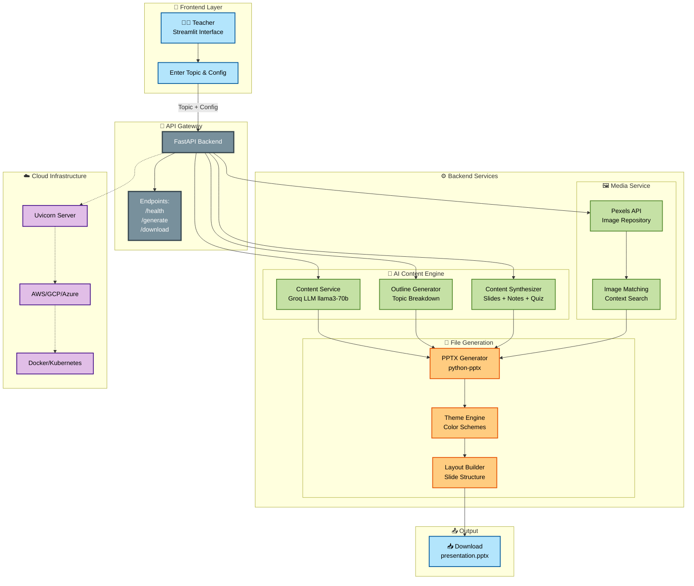

# 🎓 EduSlide AI (AI_Eduthon_TF)

- *Team Id- Ai e-250531*
- *Team: TechnoSquad*
- *Team Lead: Arya Chighare*
- *Team Members: Jaiadithya A, Veeresh Devadhar*
- *Project: Personalized AI Presentation Generator for Educators – IIT Bombay Eduthon 2025*

***

## 🚀 Overview

EduSlide AI is a full-stack solution for **automated, AI-driven educational presentation generation**. Teachers and students can enter any topic and instantly receive a ready-to-use PowerPoint (PPTX). The system adapts content for different audiences (school, college, business, technical, etc.) and includes engaging images, quiz questions, and speaker notes—powered by modern AI models.

***

## 🏛️ System Architecture



***


## 🏗️ Repository Structure

```
AI_Eduthon_TF/
├── backend/                 # FastAPI backend (API, slide & file generation)
│   ├── app/
│   │   ├── api/
│   │   ├── core/
│   │   ├── models/
│   │   ├── services/
│   │   └── main.py
│   ├── generated_presentations/
│   ├── requirements.txt
│   └── README.md
├── frontend/                # Streamlit frontend (UI, user flows)
│   ├── streamlit_app.py
│   ├── config.py
│   ├── api_client.py
│   ├── utils.py
│   ├── requirements.txt
│   └── README.md
├── README.md                # [You are here] - Project root documentation
└── .gitignore
```

***

## ✨ Features

- **AI-powered content**: Generates slides from plain-language prompts using advanced LLMs (Groq).
- **Audience adaptation**: Automatically tailors language and complexity for K-12, university, or professional audiences.
- **Multiple styles**: Supports academic, storytelling, business pitch, technical deep-dive, interactive, and minimalist templates.
- **One-click images**: Fetches royalty-free contextual images via the Pexels API.
- **Quiz & notes**: Optional automatic quiz generation and speaker notes.
- **Bilingual & multi-language**: Generate content in English/Hindi/Bilingual.
- **User-friendly interface**: Simple, step-by-step Streamlit UI.
- **Downloadable**: Instantly download generated `.pptx` files.
- **Backend health check & slide preview**.

***

## 🖥️ Quickstart Instructions

### Backend (FastAPI)

1. **Setup**
   ```bash
   git clone https://github.com/Jaiadithya71/AI_Eduthon_TF.git
   cd AI_Eduthon_TF/backend
   python -m venv venv
   source venv/bin/activate  # or venv\Scripts\activate (on Windows)
   pip install -r requirements.txt
   ```
2. **Configuration**  
   Add a `.env` file with your API credentials:
   ```
   GROQ_API_KEY=your_groq_api_key
   PEXELS_API_KEY=your_pexels_api_key
   ```
3. **Run the server**
   ```bash
   uvicorn app.main:app --host 0.0.0.0 --port 8000 --reload
   ```
   - Docs: [http://localhost:8000/docs](http://localhost:8000/docs)

### Frontend (Streamlit)

1. **Setup**
   ```bash
   cd ../frontend
   pip install -r requirements.txt
   ```
2. **(Optional) Configure Backend URL**  
   Add `.env` in `frontend`:
   ```
   BACKEND_URL=http://localhost:8000
   ```
3. **Run**
   ```bash
   streamlit run streamlit_app.py
   ```
   - Opens at [http://localhost:8501](http://localhost:8501)

***

## 🧑‍🏫 How to Use

1. **Enter your topic** (e.g., "Photosynthesis with diagrams for class 10")
2. **Select audience** (school, college, professional, etc.)
3. **Configure style, language, slides, notes, images, and quiz**
4. **Click Generate** – view live progress
5. **Preview & download** the generated presentation

***

## 📋 Frontend Features Highlights

- Interactive form: smooth input flow
- Real-time validation and feedback
- Progress bar & status messages
- Slide-by-slide preview before download
- Past generation history (session-based)

***

## 📚 Backend Features Highlights

- Robust validation of inputs (audience, language, style)
- Orchestration of LLM and image APIs
- `generated_presentations/` saves PPTX files for download
- Modular code for easy future extension (e.g., PDF export, database integration)

***

## 🩺 API Reference

API server base: `http://localhost:8000`

| Endpoint               | Method | Description                         |
|------------------------|--------|-------------------------------------|
| `/health`              | GET    | Check backend status                |
| `/generate`            | POST   | Generate slides (see below JSON)    |
| `/download/{id}`       | GET    | Download completed PPTX             |

**Example payload** for `/generate`:
```json
{
  "topic": "Photosynthesis for Class 10 students",
  "audience_level": "middle",
  "num_slides": 6,
  "presentation_style": "academic",
  "language": "english",
  "include_quiz": true,
  "speaker_notes": true,
  "color_theme": "blue"
}
```

***

## 🔧 Configuration & Customization

- Change UI texts, audiences, and styles in `frontend/config.py`
- Adjust API endpoints or logic in `backend/app/api/routes.py` and `services/`
- Add new features (e.g., advanced quiz, translation, async generation)

***

## 🛠️ Troubleshooting

- **Backend not connecting?**
  - Is uvicorn running, and port 8000 available?
  - Is `BACKEND_URL` correct in `.env`?
- **Streamlit command not found?**
  - Run `pip install streamlit`
- **API keys not set?**
  - Make sure `.env` is correctly formatted and in the right directory.

***

## 📊 Example Use Cases

- Teachers designing new lesson plans
- Students preparing project or seminar presentations
- Workshop facilitators and trainers
- Academic or corporate pitch decks
- Content creators seeking rapid slide inspiration

***

## 🤝 Team & Attribution

- **Created for IIT Bombay Eduthon 2025**
- **Team Id- Ai e-250531**
- **Team: TechnoSquad**
- **Team Lead:** Arya Chighare
- **Team Members:** Jaiadithya A, Veeresh Devadhar

***

## 📝 License

Educational use. For demo and hackathon projects only.  
_Please add license details or your own license text if required._

***

## 🏆 Next Steps / TODO

- [ ] Qdrant vector DB integration
- [ ] Advanced content and sectioning
- [ ] Voice, multi-lingual, and further template expansion
- [ ] In-app slide editing
- [ ] Batch generation
- _See `frontend/README.md` and issues for detailed roadmap._

***

**Made with ❤️ for IIT Bombay Eduthon 2025**

***

> _For any issues or feature requests, please use the repository Issues tab. PRs and contributions are welcome!_
